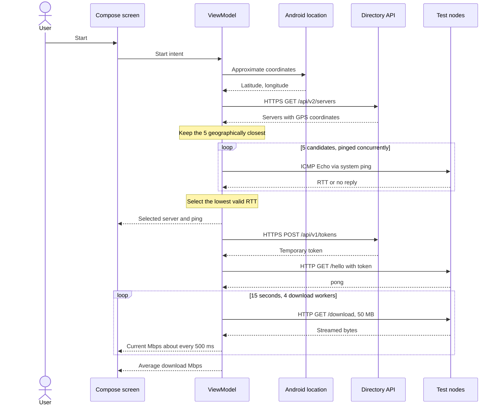
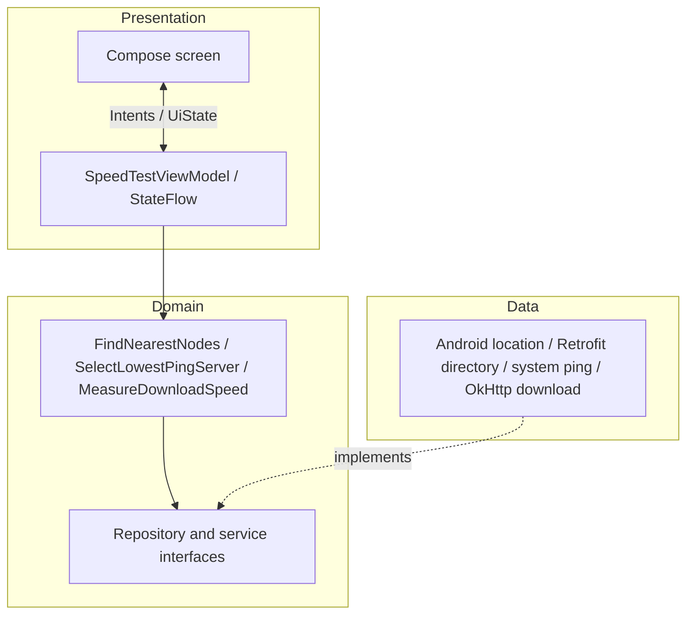

# Speed Test

A small Android speed-test sample with Clean Architecture and an MVI-style, single-screen UI. Built with Kotlin, Jetpack Compose, Material 3, ViewModel, Coroutines/Flow, Retrofit with Gson, OkHttp, and AndroidX Core.

## From Start to result

Approximate location needs only `ACCESS_COARSE_LOCATION`. Android's `LocationManager` may provide a cached fix; AndroidX `LocationManagerCompat` requests a fresh one when needed. Geographic distance narrows the directory to five candidates; **real ICMP ping**, not an HTTP timing request, picks the final server. `DownloadSpeedService` receives that server and performs the token, `/hello`, and repeated `/download` requests. Bytes are counted as they arrive, without saving the response to disk.

## Architecture

The Activity wires the implementations together. The ViewModel owns the run in `viewModelScope`; **Stop or leaving the screen cancels active work and resets the UI**. Permission denial, disabled location, missing ping replies, invalid responses, and timeouts have explicit error paths.

## Run and verify

Open the project in Android Studio, run it on Android 6.0+, enable location, and tap **Start**. The screen shows only the selected server, its ping, and download speed. Debug logs use the `SpeedTest` tag and include all five ping results. Directory and token requests use HTTPS; dynamic test nodes currently use HTTP for `/hello` and `/download`, so the app allows cleartext traffic.

Compose Previews cover the main states. Unit tests cover selection, ICMP parsing, ViewModel transitions, speed math, and download behavior with MockWebServer. Run them with `./gradlew :app:testDebugUnitTest`.
